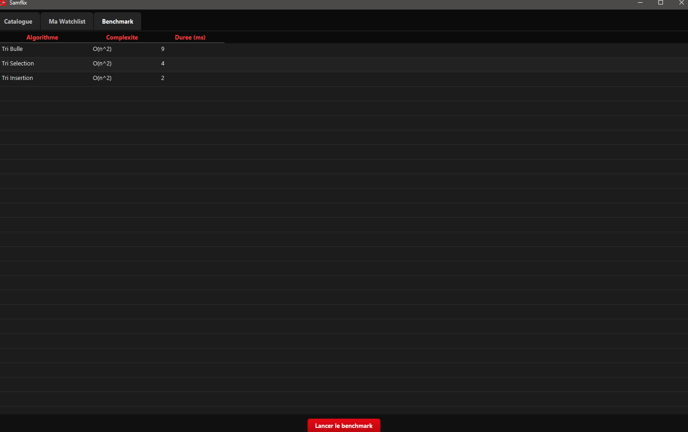
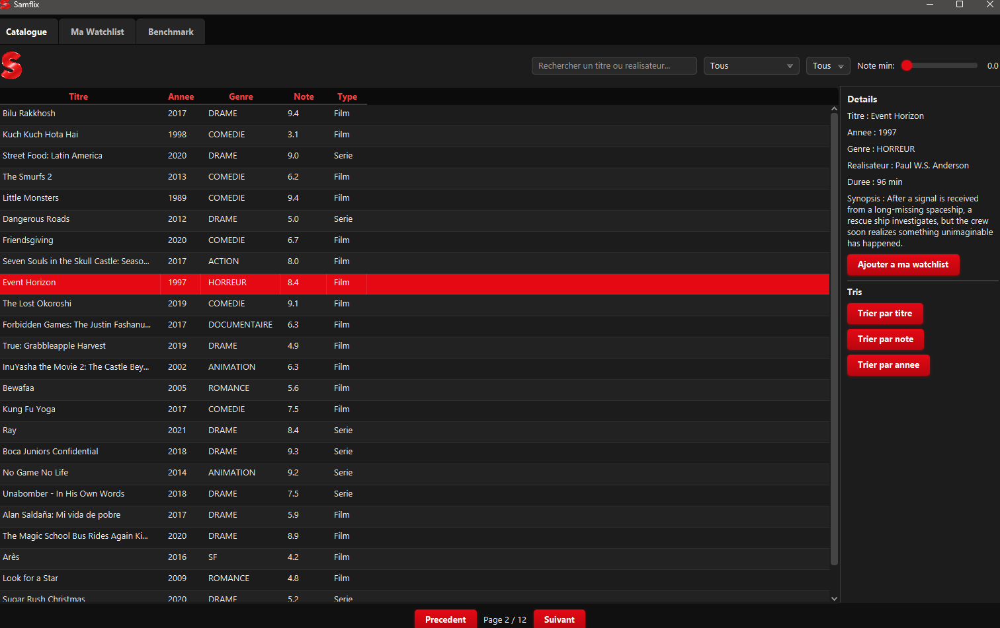
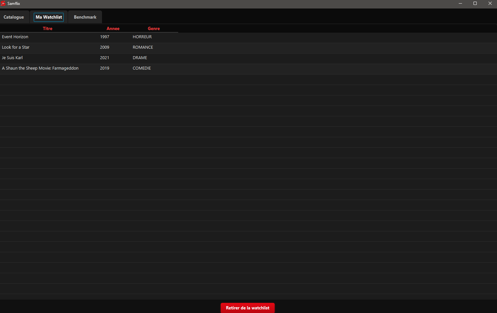

---
===
LABORATOIRE 2 - 420-930-MA - Ete 2026 - gr. 25604
===
---
   ---
   Nom du projet "Samflix"
---
   Cours : 420-930-MA — Algorithmes et modèles de programmation
   Session : Été 2026, groupe 25604
   Laboratoire : 2 (Application JavaFX v1)
   Date de remise : 13 septembre 2026, 23h59
   ---
Équipe
Nom complet 	Adresse courriel	
Samuel Lortie	samuellortie2001@gmail.com	
---
Sujet choisi
Numéro du sujet : 1
Nom du sujet : "Netflix Catalog"
---
🔗 Lien du dépôt GitHub PUBLIC
URL : https://github.com/Samy199L/LAB-NETFLIX.git

---
Fonctionnalités implémentées
- ✅ Obligatoires (cocher ce qui est fait)
- ✅ Architecture MVC avec packages séparés (model / service / algorithmes / controller / util)
- ✅ Chargement des données depuis fichier CSV (nombre de lignes : 300)
- ✅ Interface JavaFX principale avec liste/tableau
- ✅ Panneau détail affichant l'élément sélectionné
- ✅ Pagination fonctionnelle (taille de page : 12)
- ✅ Filtres multi-critères combinables (nombre implémentés :3 / 4)
- ✅ Recherche par texte en temps réel
- ✅ Interface Algorithme définie
- ✅ Tri #1 implémenté : bubble sort
- ✅ Tri #2 implémenté : tri selection
- ✅ Tri #3 implémenté : tri insertion
- ✅ Comparateur/benchmark des tris avec mesure du temps
- ✅ Wishlist / Favoris (ajout, retrait, pas de doublons)
- ✅ CSS appliqué (thème visuel du projet)


❌ Non implémenté (assumer honnêtement)
Par manque de temps, je n'ai pas fait l'implémentation de tous les filtres (Filtre décennie, filtre pays, filtre durée maximum)
d'autre alghorithme de tri que les 3 demandées et les bonus
---
Structure du projet
```

netflix-catalog-lab2/
├── pom.xml
├── src/main/
│   ├── java/
│   │   ├── module-info.java
│   │   └── org/example/NetflixLab/
│   │       ├── MainFx.java
│   │       ├── model/
│   │       │   ├── Media.java
│   │       │   ├── Film.java
│   │       │   ├── Serie.java
│   │       │   ├── Genre.java
│   │       │   ├── StatutSerie.java
│   │       │   └── Watchlist.java
│   │       ├── service/
│   │       │   ├── Donnees.java
│   │       │   ├── ServiceFiltrage.java
│   │       │   ├── FiltreCriteres.java
│   │       │   ├── TypeFilter.java
│   │       │   ├── ServicePagination.java
│   │       │   ├── ServiceTri.java
│   │       │   ├── ServiceBenchmark.java
│   │       │   └── ResultatMesure.java
│   │       ├── algorithmes/
│   │       │   ├── Algorithme.java
│   │       │   └── tri/
│   │       │       ├── TriBulle.java
│   │       │       ├── TriSelection.java
│   │       │       └── TriInsertion.java
│   │       ├── controller/
│   │       │   └── Controller.java
│   │       └── util/
│   │           └── LecteurCSV.java
│   └── resources/
│       ├── vues/
│       │   └── vue-principale.fxml
│       ├── css/
│       │   └── style.css
│       └── data/
│           └── mediasKaggleMod.csv
```
---
====
Instructions pour lancer le projet
===
Prérequis
JDK 21
Maven 3
(optionnel) IntelliJ IDEA 
Étapes
```bash
# 1. Cloner le dépôt
git clone https://github.com/Samy199L/LAB-NETFLIX.git
cd LAB-NETFLIX
 
# 2. Compiler
mvn clean compile
 
# 3. Lancer l'application
mvn clean javafx:run
```
Alternative dans IntelliJ
Ouvrir le projet dans IntelliJ (File > Open > dossier du projet)
Attendre que Maven télécharge les dépendances
Ouvrir `MainFx.java`
Cliquer sur le bouton Run
---
Choix techniques
Version Java utilisée
Java 21 avec JavaFX 21.0.4
Format des données
CSV, encodage UTF-8, 300 lignes (210 films / 90 séries — ratio 70/30). Colonnes : `id, type, titre, titre_original, annee, note, genre, pays, realisateur, duree, nb_saisons, nb_episodes, statut, description`.

Les données proviennent du dataset Kaggle "Netflix Movies and TV Shows",
modifié pour ajouter les champs manquants (fictif)
(note, titre original stylisé phonétiquement, nombre d'épisodes, statut de série),
ces champs n'existant pas dans le dataset original.
Algorithmes de tri implémentés
| Tri à bulles (Bubble Sort) | O(n²) |
| Tri par sélection (Selection Sort) | O(n²) |
| Tri par insertion (Insertion Sort) | O(n²) |
Bibliothèques externes utilisées
Aucune
---
Difficultés rencontrées
Erreur de version java/javafx,comportement du css incorrect,fichier fxml créer en scenbuilder
---
Répartition du travail (auto-évaluation)
Membre	% contribution estimée	
Samuel Lortie 100%
---
Notes pour le correcteur 
---
le travail a été realiser seul 
---
Captures d'écran (fortement recommandé)

```markdown
### Écran principal


### Écran de benchmark


### Watchlist

```

